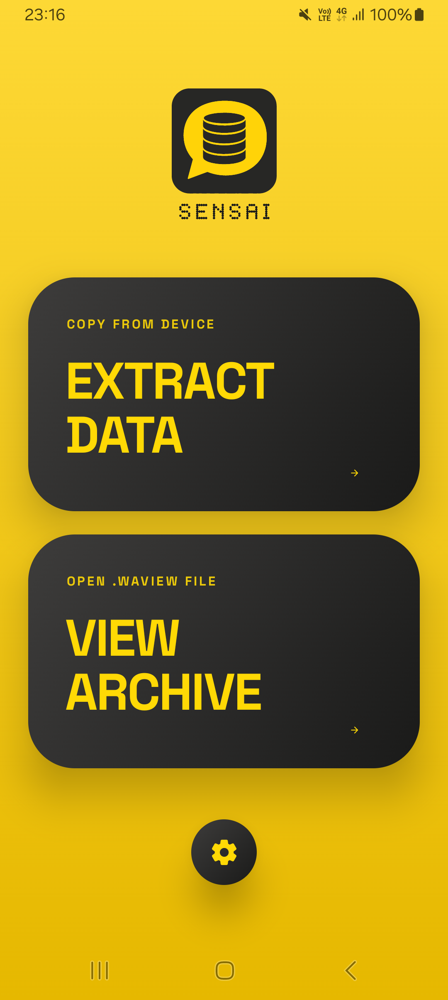
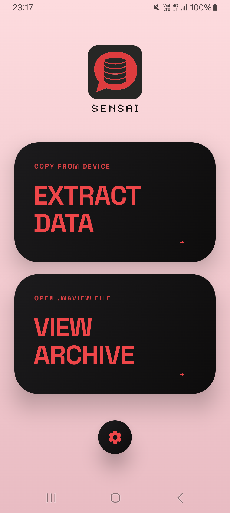
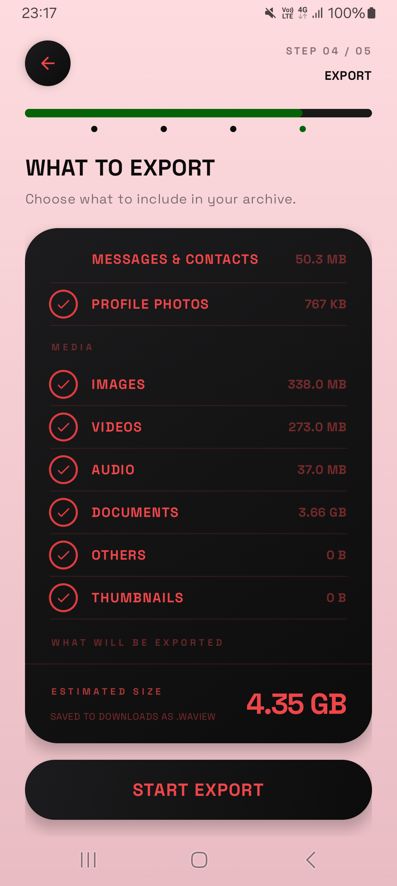
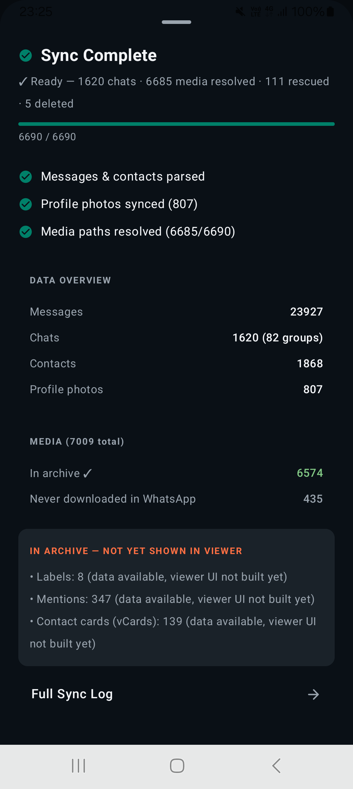
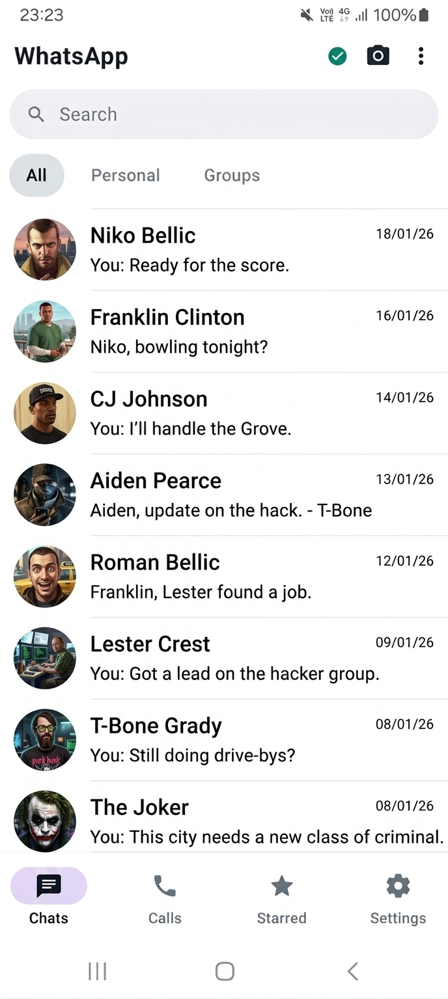
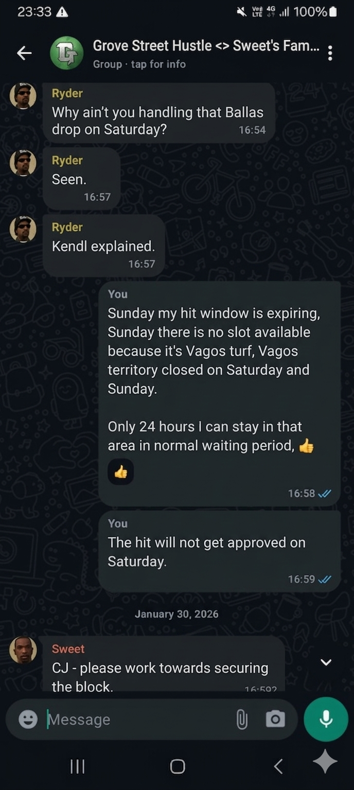

<div align="center">

# WA Sensai

📦 Rooted Android extractor and offline `.waview` viewer for WhatsApp data.

Built for high-integrity local extraction, packaging, and offline viewing of real WhatsApp Business history on rooted Android devices.

</div>

---

## 📚 Table Of Contents

- [🎯 Scope And Intent](#-scope-and-intent)
- [🧪 Tested Environment](#-tested-environment)
- [⚠️ Compatibility Notes](#️-compatibility-notes)
- [🛠️ App Specification](#️-app-specification)
- [✨ What The App Does](#-what-the-app-does)
- [📤 High-Level Extraction Flow](#-high-level-extraction-flow)
- [🗂️ How `.waview` Storage Works](#️-how-waview-storage-works)
- [🧱 Example Extracted Data Structure](#-example-extracted-data-structure)
- [👁️ How The Viewer Reads Data](#️-how-the-viewer-reads-data)
- [🏗️ Architecture Overview](#️-architecture-overview)
- [🧩 Current App Architecture In Practice](#-current-app-architecture-in-practice)
- [🚧 Major Development Setbacks And Fixes](#-major-development-setbacks-and-fixes)
- [📝 Handoff Summary](#-handoff-summary)
- [🚀 Performance Notes](#-performance-notes)
- [🔒 Privacy And Data Handling](#-privacy-and-data-handling)
- [🧱 Build And Run Notes](#-build-and-run-notes)
- [🖼️ Screenshots](#️-screenshots)
- [📁 Project Structure](#-project-structure)
- [📌 Repository Notes](#-repository-notes)
- [📣 Internal Use Disclaimer](#-internal-use-disclaimer)

> [!TIP]
> Use the links above to jump to a section. Then click the expand row under each heading to open the full content.

## ⚡ Quick Glance

| Item | Details |
| --- | --- |
| Primary purpose | Rooted WhatsApp data extraction + offline local viewer |
| Main validated target | WhatsApp Business |
| Archive format | `.waview` |
| App stack | Kotlin, Compose, Hilt, Media3, Zip4j, libsu |
| Main validated source device | Samsung Galaxy A13 `SM-A137F/DS` |
| Extra viewer validation | Samsung Galaxy S22 Ultra, Pixel 4 Emulator |
| Data realism | Real-world WhatsApp Business history, roughly `6-7 months` |

WA Sensai is a rooted Android app built for extracting WhatsApp data from a real device and packaging it into a private `.waview` archive that can later be opened in the app's built-in viewer.

This project was created for internal personal use, with the main focus on data integrity, media recovery, export reliability, and smooth offline viewing of large real-world chat history. The primary validated target was WhatsApp Business, not public multi-device compatibility across every WhatsApp variant.

The overall app experience, especially the viewer side, was built with the intention of mirroring the current WhatsApp Business feel and flow as closely as practical within this offline archive-viewing model.

> [!IMPORTANT]
> WA Sensai was built and tested mainly for an internal rooted WhatsApp Business workflow. Regular WhatsApp fallback support exists, but it was not the main validated target during development.

## 🎯 Scope And Intent

<details>
<summary><strong>Click to expand this section</strong></summary>

<br>


WA Sensai was built to:

- extract WhatsApp data from a rooted Android device
- package the extracted data into a local `.waview` archive
- preserve as much message and media integrity as possible
- open that archive inside an offline in-app viewer
- support large real chat history, not only tiny sample datasets

WA Sensai was not originally built as a public consumer product. It was developed for internal use and validated mainly against one real WhatsApp Business environment. Regular WhatsApp fallback logic exists, but regular WhatsApp was not formally validated end-to-end during the main development cycle.

</details>

## 🧪 Tested Environment

<details>
<summary><strong>Click to expand this section</strong></summary>

<br>


Primary extraction and viewer validation was done on:

- Device: Samsung Galaxy A13 `SM-A137F/DS`
- One UI: `6`
- Android version: `14`
- Security patch: `5 February 2026`
- Root: `Magisk 30.7 (30700)`
- Magisk app version: `30.7 (30700)`
- Main tested app target: `WhatsApp Business 2.26.9.72`

Additional viewer validation was also done on:

- Samsung Galaxy S22 Ultra
- Pixel 4 Android Emulator

Important testing note:

- the `.waview` files used during validation were created from real WhatsApp Business data on a real device
- testing was done against roughly `6-7 months` of actual message history
- this was used specifically to validate data integrity and viewer behavior against realistic volume, not only synthetic test data
- extraction and viewer testing were also performed on the same real source phone in the main workflow

</details>

## ⚠️ Compatibility Notes

<details>
<summary><strong>Click to expand this section</strong></summary>

<br>


- Fully validated target: WhatsApp Business
- Partially prepared fallback target: regular WhatsApp
- Regular WhatsApp was not deeply validated during the main production cycle
- If regular WhatsApp extraction does not work on a specific build, additional adjustments may be needed

</details>

## 🛠️ App Specification

<details>
<summary><strong>Click to expand this section</strong></summary>

<br>


- Language: Kotlin
- UI: Jetpack Compose + Material 3
- Dependency Injection: Hilt
- Serialization: Kotlinx Serialization
- Image loading: Coil 3
- Media playback: AndroidX Media3 / ExoPlayer
- Archive handling: Zip4j
- Root access: libsu
- Android model: single-app extractor + local archive viewer
- Main format: `.waview`
- Current archive format generation: format version 3

</details>

## ✨ What The App Does

<details>
<summary><strong>Click to expand this section</strong></summary>

<br>


WA Sensai has two major responsibilities:

1. Extraction
2. Viewing

### 1. Extraction

The extractor runs on a rooted Android device and copies the required WhatsApp databases and media-related files from protected app storage into WA Sensai's own controlled flow.

It then processes and packages:

- contacts
- chats
- messages
- reactions
- polls
- groups
- call logs
- labels
- mentions
- vcards
- statuses
- message edit history
- avatar/media references and indexed media metadata

The result is a self-contained `.waview` archive intended for offline viewing later.

### 2. Viewing

The viewer opens an existing `.waview` archive, reads the exported structured data, rebuilds chat lists and timelines, resolves media from the archive, and renders the data in a WhatsApp-style local viewer flow.

The viewer was refactored heavily to handle larger exports more safely and more smoothly.

</details>

## 📤 High-Level Extraction Flow

<details>
<summary><strong>Click to expand this section</strong></summary>

<br>


At a high level, extraction works like this:

1. Detect and verify rooted access.
2. Detect WhatsApp / WhatsApp Business installation.
3. Copy the required source databases and supporting files into the app's working area.
4. Parse the copied data into Kotlin models.
5. Build a structured export object graph.
6. Build media index information and media availability state.
7. Package everything into a `.waview` archive.

Important design goals during extraction:

- avoid touching live source data more than necessary
- prefer packaged archival integrity over quick-and-dirty copying
- preserve message structure and metadata
- preserve media references even when some files are missing
- distinguish available, missing, and deleted/unrecoverable media states

</details>

## 🗂️ How `.waview` Storage Works

<details>
<summary><strong>Click to expand this section</strong></summary>

<br>


The `.waview` file is a private archive container used by WA Sensai.

At a high level, it stores:

- export metadata
- serialized structured datasets for viewer reconstruction
- media index information
- extracted avatar/media payloads where available
- archive-level information needed by the viewer to open and resolve content safely

Privacy note:

- this README intentionally avoids exposing your private internal sample names or personal dataset identifiers
- the format description here stays conceptual and implementation-oriented

Implementation direction used in this project:

- `.waview` is handled as a zip-based packaged archive
- archive creation uses `STORE` compression strategy in the current generation path
- media is indexed instead of treated as an uncontrolled loose-file dump
- viewer loading relies on archive indexing, media resolution rules, and cache extraction when needed

</details>

## 🧱 Example Extracted Data Structure

<details>
<summary><strong>Click to expand this section</strong></summary>

<br>


The real extracted data used during development followed a structure broadly like this before packaging. The example below is privacy-safe and intentionally generalized, but it reflects the actual shape of the extracted working data:

```text
Extracted/
├── meta/
│   └── version.json              # Export metadata / format version information
├── data.json                     # Main serialized structured export payload
├── msgstore.db                   # Copied WhatsApp message database used for extraction
├── wa.db                         # Copied WhatsApp contacts/profile database used for extraction
├── avatars/
│   ├── me.j                      # Self avatar reference/output
│   ├── <contact>.j               # Per-contact avatar output
│   ├── <group>.j                 # Group avatar output
│   └── <newsletter>.j            # Newsletter/channel avatar output when present
└── media/
    └── WhatsApp Business/
        ├── Databases/            # Source encrypted backup databases found on device
        ├── Media.zip             # Packed media payload snapshot used during processing
        ├── .Shared/              # App/internal temporary media-related files from source tree
        ├── .StickerThumbs/       # Sticker thumbnail cache area
        ├── .trash/               # Source-side deleted/trash remnants when present
        ├── Backups/              # Backup-related files such as stickers/settings/db backups
        └── Media/
            ├── WhatsApp Business Images/                  # Image media
            ├── WhatsApp Video/                            # Video media
            ├── WhatsApp Voice Notes/                      # Voice note / PTT media
            ├── WhatsApp Documents/                        # Document media
            ├── WhatsApp Calls/                            # Call-related media if present
            ├── WhatsApp Business Animated Gifs/           # GIF media
            ├── WhatsApp Business Sticker Packs/           # Sticker pack assets
            ├── WhatsApp Business Premium Message Media/   # Business-specific media area
            ├── WhatsApp Business Quick Reply Attachments/ # Quick reply attachment media
            ├── WhatsApp Business Bug Report Attachments/  # Bug-report related attachments
            └── WallPaper/                                 # Wallpaper-related media from source tree
```

Notes about this structure:

- this is based on a real extraction layout used during development
- names and contents have been generalized to protect private data
- the final `.waview` archive is a packaged viewer-oriented format, not just a raw folder dump
- WA Sensai does not rely on exposing private real contact names in documentation

</details>

## 👁️ How The Viewer Reads Data

<details>
<summary><strong>Click to expand this section</strong></summary>

<br>


The viewer flow is not just "open zip and show messages". The current app uses a more structured loading pipeline:

1. Open the `.waview` archive.
2. Index the archive contents.
3. Read and deserialize structured export data into in-memory models.
4. Build viewer state for chats, contacts, calls, labels, and related entities.
5. Sync archive metadata and media availability state.
6. Build precomputed render models for chat lists and chat timelines.
7. Resolve media lazily and safely when the UI needs it.

Important viewer characteristics in the current codebase:

- zip indexing before heavy viewer usage
- guarded media extraction and media validity checks
- archive read synchronization around zip access
- chat-level media loading safeguards
- deleted/missing media handling instead of silent crashes
- preload-heavy viewer strategy for faster later chat opens
- render-model-based chat and chat-list drawing for smoother UI

Important loading note:

- the first archive open can take noticeably longer, because the heavy work is intentionally front-loaded at the beginning
- this is by design: archive sync, indexing, preload work, and initial render preparation are done early so later chat navigation feels smoother
- in short, first load is heavier so chat browsing after that can be faster and more stable

</details>

## 🏗️ Architecture Overview

<details>
<summary><strong>Click to expand this section</strong></summary>

<br>


The app is organized into clear layers:

### Root / Device Access Layer

- verifies root access
- locates WhatsApp / WhatsApp Business data
- copies protected files safely for extraction

### Extraction Layer

- parses copied source data
- transforms raw records into app export models
- prepares archive-ready structures

### Archive / Export Layer

- writes the final `.waview` package
- records export metadata
- packages media/index data with the structured export

### Repository Layer

- coordinates extraction flow
- coordinates viewer loading flow
- owns archive read, sync, and media-resolution logic

### ViewModel Layer

- manages UI-facing state for home, extraction, and viewer flows
- coordinates navigation-level screen state and screen actions

### UI Layer

- Compose screens for extraction, settings, home, and viewer
- dedicated viewer render models for chat list and chat timeline
- themed offline chat-style browsing experience

</details>

## 🧩 Current App Architecture In Practice

<details>
<summary><strong>Click to expand this section</strong></summary>

<br>


The current app combines two major phases of work:

### Handoff Phase 1: Core `v12` extraction + viewer stabilization

This phase established the core product:

- rooted extraction flow
- `.waview` packaging
- structured export model
- media indexing
- avatar handling
- deleted / unavailable media safety
- viewer repository and archive load pipeline
- stable offline viewer foundation

### Handoff Phase 2: post-`v12` viewer performance and loading redesign

This phase focused on the heavy viewer problems seen with real data:

- chat open/reopen jank reduction
- chat-list flattening
- route-first navigation behavior
- preload strategy changes
- loading-state redesign
- wallpaper draw-cost cleanup
- render-model based chat UI preparation
- memory pressure tuning
- profiling-backed narrowing of fixed screen mount cost

The current codebase reflects both phases together.

</details>

## 🚧 Major Development Setbacks And Fixes

<details>
<summary><strong>Click to expand this section</strong></summary>

<br>


The project went through several practical problems during production. The most important categories were:

### 1. Media reliability and missing-file handling

Problem:

- real exports contain mixed media states
- some media can be missing, deleted, or only partially recoverable
- unsafe media assumptions can crash the viewer or create false "working" states

Fix direction:

- indexed media state tracking
- guarded media resolution pipeline
- validity checks before playback/open
- explicit deleted/missing placeholders
- synchronization around archive reads

### 2. Archive read safety

Problem:

- large archive access plus repeated reads can become fragile if handled loosely

Fix direction:

- archive indexing
- coordinated zip access
- guarded extraction-to-cache behavior
- repository-owned resolution logic instead of scattered screen-level file handling

### 3. Viewer performance on real chat history

Problem:

- large real chats caused slow opens, jank, and heavy work at the wrong time

Fix direction:

- route-first chat navigation
- render-model preparation
- chat-list row model flattening
- timeline prebuild work
- preload strategy redesign
- lighter wallpaper/background drawing path

### 4. Loading-state quality

Problem:

- slow transitions felt broken when heavy work happened invisibly

Fix direction:

- explicit loading states
- current-route chat readiness state
- staged preparation before full chat rendering

### 5. Theme and system bar handling

Problem:

- newer Android SDK targets deprecated older direct system bar coloring patterns

Fix direction:

- edge-to-edge behavior retained
- icon appearance handling kept
- deprecated direct viewer-theme system bar color writes removed

</details>

## 📝 Handoff Summary

<details>
<summary><strong>Click to expand this section</strong></summary>

<br>


This repository is the result of multiple handoff-style development sessions.

### Handoff 1: Foundation and stability

The first major handoff produced the main extractor/viewer base:

- root access workflow
- export pipeline
- archive structure
- broad model coverage
- media-safety groundwork
- initial viewer architecture

### Handoff 2: Performance-focused viewer iteration

The later handoff focused on real-world viewer behavior under heavier data:

- loading redesign
- preloading changes
- route-level viewer state work
- render model introduction
- wallpaper/render-cost cleanup
- smoother chat list and chat open behavior

### Current State

The current app keeps the stable extractor/archive design from the first major handoff and the smoother viewer behavior introduced in the later performance session.

</details>

## 🚀 Performance Notes

<details>
<summary><strong>Click to expand this section</strong></summary>

<br>


Internal testing showed the app working well on:

- the main Samsung Galaxy A13 source device
- Samsung Galaxy S22 Ultra
- Pixel 4 Android Emulator

Exact profiled CPU and RAM numbers for the Galaxy S22 Ultra were not preserved as formal public metrics in the repository documentation, so this README does not claim specific resource figures that were not recorded. The practical outcome from internal testing was that the viewer behavior was acceptable and working correctly on that device.

</details>

## 🔒 Privacy And Data Handling

<details>
<summary><strong>Click to expand this section</strong></summary>

<br>


- WA Sensai is intended for local use
- the project handles exported private messaging data
- no public sample dataset is included in this repository
- this README intentionally avoids exposing personal dataset names or internal private identifiers
- viewer archives should be handled carefully because they may contain sensitive personal history

</details>

## 🧱 Build And Run Notes

<details>
<summary><strong>Click to expand this section</strong></summary>

<br>


### Requirements

- Android Studio
- Android SDK compatible with `compileSdk 35`
- rooted Android device for extraction use cases
- WhatsApp Business for the main validated path

### Important Notes

- extraction functionality depends on root access
- viewer functionality depends on valid `.waview` exports
- Android Studio or Gradle builds will regenerate local folders such as `.gradle`, `.idea`, `.kotlin`, and `build`
- `local.properties` is machine-specific and should not be committed publicly

</details>

## 🖼️ Screenshots

Main app screens:

<p align="center">
  
  
  
</p>

<p align="center">
  
  
  
</p>

Important note:

- two screenshots were intentionally edited for privacy protection
- those edited screenshots were also visually pushed more toward a GTA San Andreas style vibe
- the edited screenshots are the chat list screen and the chat window screen

## 📁 Project Structure

<details>
<summary><strong>Click to expand this section</strong></summary>

<br>


This section describes the current repository layout and the purpose of the main Kotlin files.

```text
WASensai/
├── app/                              # Android application module
│   ├── src/main/java/com/mazin/wasensai/
│   │   ├── MainActivity.kt           # Activity entry point, edge-to-edge host
│   │   ├── MainActivityContent.kt    # Top-level Compose content and app theme host
│   │   ├── WaSensaiApp.kt            # Application class and Hilt entry point
│   │   ├── data/
│   │   │   ├── datastore/
│   │   │   │   └── SettingsDataStore.kt      # Theme/accent preference storage
│   │   │   ├── model/                         # Export and viewer data models
│   │   │   │   ├── CallLog.kt                # Call history model
│   │   │   │   ├── Chat.kt                   # Chat/session metadata model
│   │   │   │   ├── Contact.kt                # Contact model
│   │   │   │   ├── ExportInfo.kt             # Export metadata model
│   │   │   │   ├── Group.kt                  # Group and participant-related model data
│   │   │   │   ├── Label.kt                  # Label and message-label mapping models
│   │   │   │   ├── MediaEntry.kt             # Media index / media archive entry model
│   │   │   │   ├── Mention.kt                # Mention model
│   │   │   │   ├── Message.kt                # Message model
│   │   │   │   ├── MessageEdit.kt            # Message edit history model
│   │   │   │   ├── Poll.kt                   # Poll and vote models
│   │   │   │   ├── Reaction.kt               # Message reaction model
│   │   │   │   ├── StatusUpdate.kt           # Status model
│   │   │   │   └── VCard.kt                  # Shared contact card model
│   │   │   └── repository/
│   │   │       ├── ExtractRepository.kt      # Extraction orchestration and data assembly
│   │   │       └── ViewerRepository.kt       # Archive open/load/sync/media resolution logic
│   │   ├── export/
│   │   │   └── ExportManager.kt              # `.waview` archive packaging writer
│   │   ├── root/
│   │   │   └── RootFileAccess.kt             # Root-driven file discovery/copy access
│   │   ├── ui/
│   │   │   ├── components/
│   │   │   │   └── ChatWallpaper.kt          # Chat wallpaper surface for viewer chats
│   │   │   ├── navigation/
│   │   │   │   └── NavGraph.kt               # Compose navigation graph
│   │   │   ├── screens/
│   │   │   │   ├── about/
│   │   │   │   │   └── AboutScreen.kt                 # About page
│   │   │   │   ├── extract/
│   │   │   │   │   ├── ExtractDesignUtils.kt          # Shared extraction UI helpers
│   │   │   │   │   ├── ExtractFlowScreen.kt           # Main extraction flow container
│   │   │   │   │   ├── ExtractForceStopScreen.kt      # Stop/force-stop guidance screen
│   │   │   │   │   ├── ExtractOptionsScreen.kt        # Extraction options UI
│   │   │   │   │   ├── ExtractProgressScreen.kt       # Live extraction progress UI
│   │   │   │   │   ├── ExtractRootScreen.kt           # Root status / prerequisite screen
│   │   │   │   │   └── ExtractScanScreen.kt           # Scan / detection screen
│   │   │   │   ├── home/
│   │   │   │   │   └── HomeScreen.kt                  # Main launcher/home screen
│   │   │   │   ├── settings/
│   │   │   │   │   ├── AccentColorPickerScreen.kt     # Accent color picker
│   │   │   │   │   └── SettingsScreen.kt              # App settings screen
│   │   │   │   └── viewer/
│   │   │   │       ├── CallsScreen.kt                 # Exported call log viewer screen
│   │   │   │       ├── ChatListRenderModels.kt        # Prebuilt chat-list UI row models
│   │   │   │       ├── ChatListScreen.kt              # Chat list and sync status UI
│   │   │   │       ├── ChatRenderModels.kt            # Prebuilt chat timeline render models
│   │   │   │       ├── ChatScreen.kt                  # Main conversation viewer screen
│   │   │   │       ├── ContactInfoScreen.kt           # Contact/group info viewer
│   │   │   │       ├── FullScreenMediaScreen.kt       # Full-screen image/video viewer
│   │   │   │       ├── MediaGalleryScreen.kt          # Shared media/documents gallery
│   │   │   │       ├── SettingsScreen.kt              # Viewer-specific settings UI
│   │   │   │       ├── StarredScreen.kt               # Starred messages screen
│   │   │   │       ├── ViewerScreen.kt                # Viewer root and section navigation
│   │   │   │       └── ViewerUiState.kt               # Viewer UI state models
│   │   │   └── theme/
│   │   │       ├── Color.kt                  # Base app palette values
│   │   │       ├── Theme.kt                  # Main app theme
│   │   │       ├── Type.kt                   # Typography setup
│   │   │       └── ViewerTheme.kt            # Dedicated viewer theme
│   │   ├── utils/
│   │   │   ├── DateUtils.kt                  # Date/time formatting helpers
│   │   │   └── FileUtils.kt                  # File/path helper utilities
│   │   └── viewmodel/
│   │       ├── ExtractViewModel.kt           # Extraction UI state and actions
│   │       ├── HomeViewModel.kt              # Home/settings state bridge
│   │       └── ViewerViewModel.kt            # Viewer state, preload, and navigation logic
│   ├── src/main/res/                 # Drawables, fonts, launcher assets, XML config
│   └── src/main/AndroidManifest.xml  # App manifest, permissions, intents, provider
├── gradle/                           # Gradle version catalog and wrapper support files
├── build.gradle.kts                  # Root Gradle config
├── settings.gradle.kts               # Module inclusion and repository setup
├── gradle.properties                 # Gradle runtime options
├── gradlew / gradlew.bat             # Gradle wrapper scripts
└── WASensai_FULL_v12.md              # Internal development handoff documentation
```

</details>

## 📌 Repository Notes

<details>
<summary><strong>Click to expand this section</strong></summary>

<br>


- The repository currently includes internal handoff documentation used during development.
- The public-facing README is intentionally privacy-safe.
- If this project is uploaded publicly, review every document and asset before publishing.
- Consider whether internal handoff files should remain in the public repository.

</details>

## 📣 Internal Use Disclaimer

<details>
<summary><strong>Click to expand this section</strong></summary>

<br>


WA Sensai was built around a real personal workflow and a real rooted Android device environment. The app worked well in that validated internal use case, but broad public compatibility across all devices, all Android variants, and all WhatsApp package variations should not be assumed without further testing.

</details>
